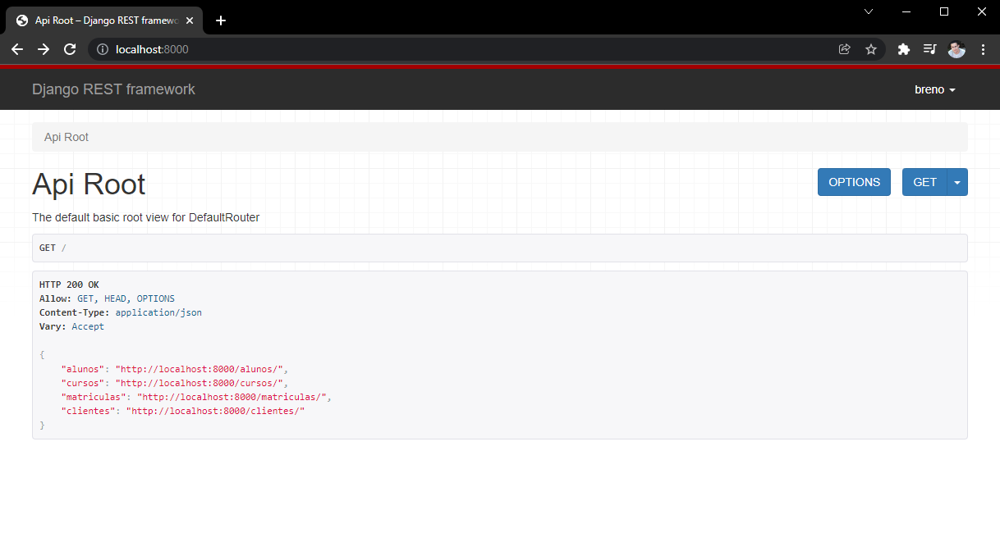

<h1 align="center">
  
</h1>

  <a href="#technologist-tecnologias">Tecnologias</a>&nbsp;&nbsp;&nbsp;|&nbsp;&nbsp;&nbsp;
  <a href="#-projeto">Projeto</a>&nbsp;&nbsp;&nbsp;|&nbsp;&nbsp;&nbsp;
  <a href="#-como-executar">Como executar</a>&nbsp;&nbsp;&nbsp;|&nbsp;&nbsp;&nbsp;
  <a href="#-licença">Licença</a>

  
  
  

  

 

## :technologist: Tecnologias

Este projeto faz uso das seguintes tecnologias:
- [Python](https://www.python.org/)
- [Django](https://www.djangoproject.com/)
- [Django Rest Framework](https://www.django-rest-framework.org/).
 

## 💻 Projeto

O DRF-Escola é uma API para o simples gerenciamento de alunos, cursos, matrículas e clientes e foi desenvolvida com o propósito simples propósito de testar as funcionalidades do Django Rest Framework.
 
 

## 🚀 Como executar

- Clone o repositório
- No diretório do projeto inicie um ambiente virtual com `python -m venv venv`
- Ative o ambiente virtual, considerando que está utilizando o powershell no windows execute `.\venv\Scripts\activate`
- Atualize o pip com `python -m pip install --upgrade pip`
- Instale as dependências com `pip install -r requirements.txt`
- Execute as migrações com `python manage.py migrate`
- Crie o primeiro usuário com `python manage.py createsuperuser`
- Inicie o servidor com `python manage.py runserver`

O servidor deverá iniciar no endereço: [http://localhost:8000](http://localhost:8000)
 
 

## 📄 Licença

Acesse [LICENSE](LICENSE.md) para mais informações sobre a licença.
